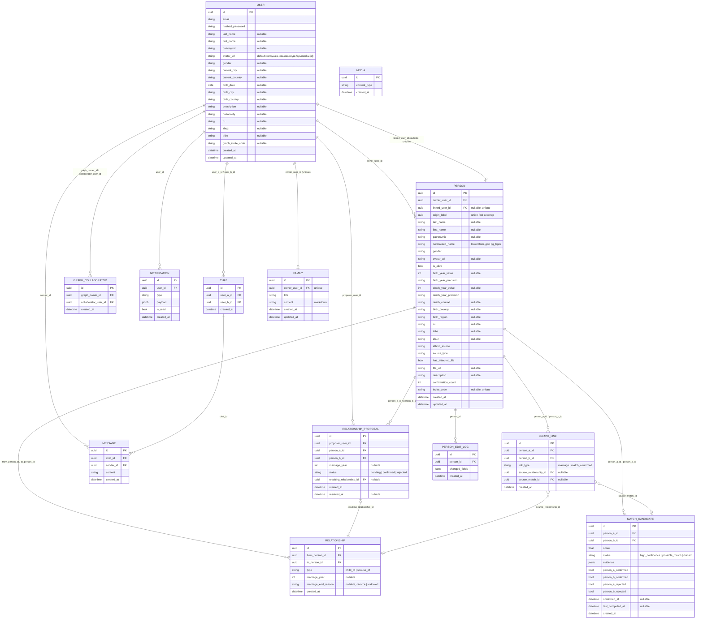
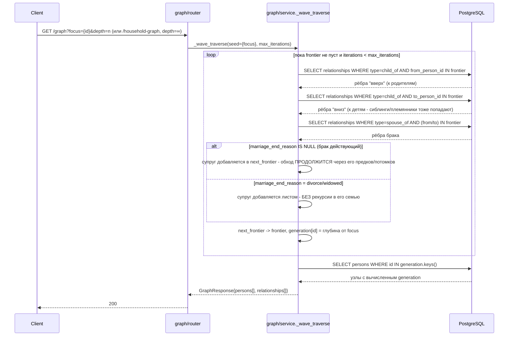
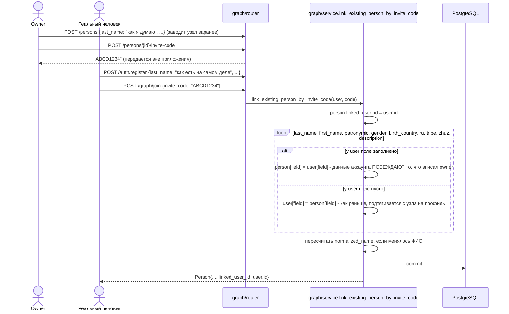
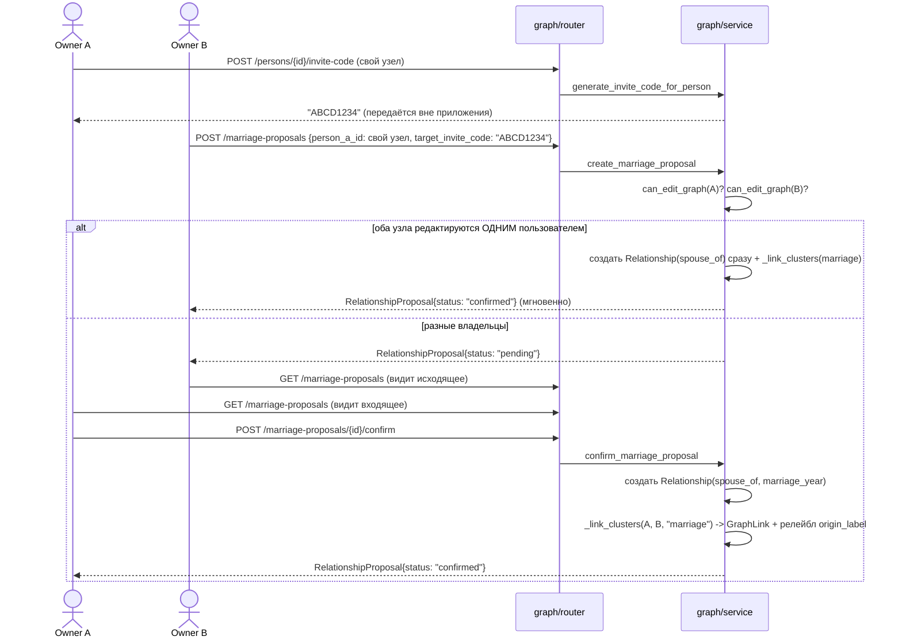
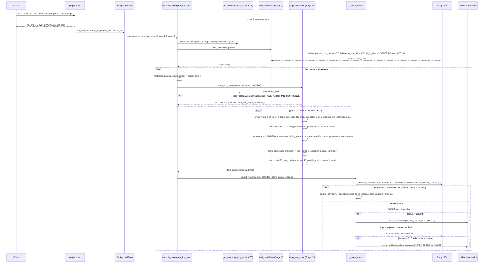
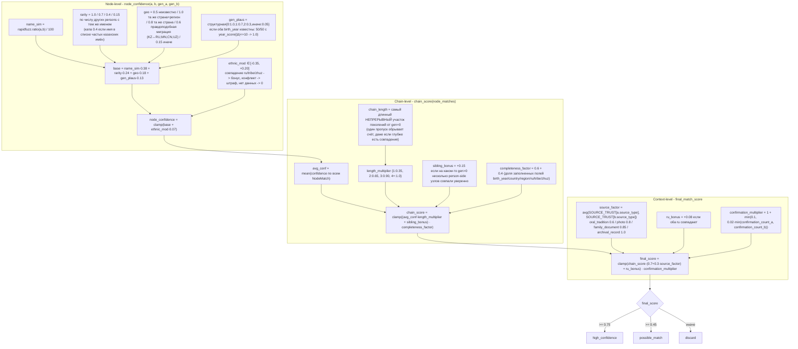

# Jeli

**Краудсорсингая платформа восстановления родословной**

Контрибьютуторы 
- https://github.com/moera-sudo
- https://github.com/itszhdi

Проект **Jeli** выполнен в рамках хакатона **TechVision** в период с 17 по 21 июля.

# Описание серверной части

## Стэк

Серверная часть проекта выполнена целиком на языке программирования **Python 3.14**
с использованием веб-фреймворка **FastAPI**, ключевые зависимости проекта представляют из себя

1) UV - Используемый пакетный менеджер для Python
2) FastAPI - Веб-Фреймворк
3) SQLAlchemy - ОРМ для взаимодействия с базой данных
4) asyncpg - Асинхронный драйвер для взаимодействия с базой данных
5) rapidfuzz - Библиотека нечёткого сравнения строк, используется в алгоритме мэтчинга
   для оценки схожести ФИО между узлами разных деревьев (`fuzz.ratio`)
6) alembic - инструмент миграций БД
7) pyjwt + passlib/bcrypt - выпуск/проверка JWT-токенов и хеширование паролей (аутентификация)
8) python-multipart - обработка multipart-запросов (загрузка файлов в фиче media)

### Дополнительные инструменты
- PostgreSQL - Основная база данных (включая расширение `pg_trgm` - нечёткий поиск по имени в мэтчинге)
- docker/docker-compose - Инструменты контейнеризации для запуска проекта
- make - Утилита менеджера консольных команд для удобного управления проектом
- bruno - Инструмент API тестирования эндпоинтов. Вся Bruno коллекция доступна на GitHub в Jeli-Bruno

## Архитектура

Проект представляет из себя клиент-серверную монолитную архитектуру: FastAPI-бэкенд + PostgreSQL,
поднимаются вместе через Docker Compose. Клиентская часть разворачивается отдельно. Документация ко всем эндпоинтам доступна при запуске проекта по машруту `/api/docs` и `/api/redoc`. 

### 1. База данных, FastAPI и структура проекта

Верхнеуровневая структура `src/`:

```
src/
├── config/            # settings.py (Pydantic Settings из .env), database.py (async engine/session), logging.py
├── dependencies.py     # общие FastAPI-зависимости - get_user, get_user_ws
├── exceptions.py       # базовая иерархия AppException + единый обработчик ошибок
├── models.py           # агрегатор ORM-моделей всех фич (нужен Alembic для autogenerate)
├── router.py            # агрегатор роутов всех фич под общим префиксом /api
├── ws_manager.py        # синглтон ConnectionManager - общий WebSocket-менеджер
├── main.py             # точка входа FastAPI-приложения
└── features/
    ├── auth/
    ├── user/
    ├── graph/
    ├── matching/
    ├── notifications/
    ├── media/
    ├── messenger/
    ├── family/
    └── search/
```

Каждая фича в `features/` - самодостаточный модуль со своим `router.py` (эндпоинты), `schemas.py`
(Pydantic-модели запросов/ответов), `models.py` (ORM-модели), `service.py` (бизнес-логика),
`exceptions.py` (свои исключения, наследуются от общей иерархии `src/exceptions.py`),
`constants.py` и `utils.py` - без единой "God"-папки на весь проект. Такое разделение:

- **не даёт коду фич смешиваться** - правки в `graph` не тянут за собой случайных изменений в
  `matching` или `messenger`, у каждой фичи чётко определены зависимости от других (например,
  `matching` зависит от `graph`, но не наоборот - это соблюдается по всему проекту, чтобы не
  возникало циклических импортов);
- **упрощает онбординг и ревью** - разработчик, открывший `features/media/`, сразу видит весь
  контракт фичи (что принимает, что хранит, что отдаёт), не прыгая по всему репозиторию;
- **масштабируется линейно** - добавление новой фичи (как `family` или `search` на позднем этапе
  разработки) не требует трогать существующие модули, только зарегистрировать роутер/модели в
  `src/router.py`/`src/models.py`;
- **`dependencies.py`** - место для зависимостей, нужных СРАЗУ нескольким фичам (`get_user` -
  универсальная проверка Bearer-токена, `get_user_ws` - то же самое для WebSocket через
  query-параметр `?token=`, т.к. браузерный `WebSocket` API не умеет слать заголовки);
- **`exceptions.py`** - все доменные ошибки наследуются от `AppException` с собственным
  `status_code`, единый глобальный обработчик превращает их в консистентный JSON
  `{"detail": "..."}` - фичам не нужно вручную формировать HTTP-ответы на ошибки.

#### Схема базы данных (ERD)



`MEDIA` не имеет входящих внешних ключей - на неё ссылаются просто строкой `/api/media/{id}` из
полей `avatar_url`/`file_url`/`content` (markdown семьи), не через FK. Файл лежит на диске под
именем `id`, `content_type` в БД нужен только чтобы `GET /media/{id}` отдал верный `Content-Type`.

### 2. Auth, Family, Media, Search, User

- **auth** - отвечает за создание аккаунта и выдачу сессии, ничего больше не знает о графе или
  профиле. Регистрация нарочно устроена в двух вариантах - короткая (только email, пароль, ФИО) и
  полная (сразу с городом, датой рождения, родовыми признаками и т.д.), чтобы не заставлять
  человека проходить многошаговую анкету, если он и так готов заполнить всё сразу. Пароль никогда
  не хранится в открытом виде - только bcrypt-хэш. Сессия полностью stateless: и access-, и
  refresh-токен - обычные JWT, сервер не хранит списков активных сессий и не может их досрочно
  отозвать - обновление токена - это просто проверка подписи старого refresh-токена и выпуск новой
  пары. Код приглашения в дерево можно передать прямо при регистрации, чтобы человек сразу
  зарегистрировался и присоединился к своему узлу одним действием, а не двумя отдельными.
- **user** - хранит личный профиль аккаунта (контакты, гео, дата рождения, родовые признаки,
  биография) отдельно от узла в дереве - это два разных объекта, потому что один и тот же человек
  может ещё не иметь своего узла в графе или, наоборот, у узла может не быть привязанного аккаунта.
  Именно данные из этого профиля считаются авторитетными: когда человек присоединяется к своему
  узлу по коду, они побеждают то, что за него вписал владелец дерева (см. раздел про Graph).
  Удаление аккаунта не происходит "в вакууме" - если пользователь был единственным владельцем
  графа, в котором есть другие зарегистрированные родственники, система сначала требует передать
  им владение, иначе отказывает.
- **family** - совместная письменная история рода, а не личный дневник каждого пользователя: одна
  запись **на весь граф**, а не на человека. Смысл в том, что все члены одной семьи - владелец
  графа, коллабораторы, привязанные к узлам родственники - читают и правят один и тот же текст, и
  результат виден всем одинаково, а не расходится на версии. В текст истории можно вставлять
  фотографии через общую фичу media.
- **media** - минимальный слой хранения файлов, не самостоятельная фича, а обслуживающая
  прослойка для остальных (аватарки, фото в истории семьи). Специально устроена так, чтобы
  отдавать уже загруженный файл без авторизации - иначе обычный `` на фронтенде просто не
  показал бы картинку, ведь браузер не прикладывает Bearer-токен к загрузке изображений. Отдельно
  есть укороченный путь "загрузить и сразу привязать" - одним вызовом можно поставить аватар и
  себе, и любому узлу дерева, включая узел уже умершего человека: наличие фотографии в семейном
  архиве никак не зависит от того, жив ли человек.
- **search** - способ найти конкретного родственника в системе по имени, когда под рукой ещё нет
  его инвайт-кода. Ищет по нечёткому вхождению подстроки в ФИО зарегистрированных пользователей
  (не по узлам дерева), никогда не находит самого себя, и сразу сообщает, привязан ли найденный
  человек к какому-то узлу - именно это позволяет показать кнопку "написать" прямо в результатах
  поиска, не делая для этого отдельный запрос.

### 3. WebSocket, чаты и уведомления

Всё real-time приложение держится на **одном** WebSocket-эндпоинте - `GET /api/ws?token=...` -
и одном синглтоне `ws_manager.ConnectionManager` (`src/ws_manager.py`): словарь `user_id -> активное
соединение`, максимум одно соединение на пользователя. Авторизация - access-JWT в
query-параметре `token`, а не в заголовке `Authorization`: обычный браузерный `WebSocket` API не
умеет слать кастомные заголовки при хендшейке, поэтому токен передаётся в URL. Если токен
отсутствует/невалиден - соединение закрывается кодом `1008` **до** `accept()`, чтобы клиент получил
честный отказ хендшейка, а не разрыв уже установленного соединения.

Все события, независимо от того, какая фича их породила, идут через один и тот же сокет и
различаются только полем `"type"` в JSON-теле - это и называется мультиплексированием:

```jsonc
{"type": "message", "message": {...}}          // messenger
{"type": "notification", "notification": {...}} // notifications
```

Канал строго push-only от сервера: клиент ничего не обязан присылать, всё, что он всё же пришлёт,
сервер просто игнорирует (`async for _ in websocket.iter_text(): pass`).

**Notifications** (`src/features/notifications/`) - персональные события пользователя.
`create_notification()` **всегда** сохраняет запись в БД (для истории и офлайн-доступа) и
**дополнительно** пушит её через `ConnectionManager.send_to_user`, если получатель сейчас онлайн -
если нет, событие просто ждёт в истории до следующего `GET /notifications`. Типы уведомлений
рождаются в других фичах через события: новый мэтч, заметное изменение скора мэтча, новое
сообщение в чате. Эндпоинты: `GET /notifications` (список, есть фильтр `unread_only`),
`POST /notifications/{id}/read`, `POST /notifications/read-all`, `DELETE /notifications/{id}`.

**Messenger** (`src/features/messenger/`) - простые 1-на-1 текстовые чаты поверх того же сокета.
`Chat.user_a_id`/`user_b_id` хранятся в каноническом порядке (по `str(id)`, та же схема, что у
`MatchCandidate.person_a_id/person_b_id`) - это делает `POST /chats` идемпотентным: повторный вызов
с тем же `person_id` вернёт уже существующий чат, а не создаст дубликат, независимо от того, кто из
двоих инициировал разговор первым. При отправке сообщения (`POST /chats/{id}/messages`) сервис:
1. сохраняет `Message` в БД;
2. пушит получателю (если онлайн) `{"type": "message", ...}` - для мгновенной отрисовки в открытом
   чате;
3. параллельно создаёт `notifications`-уведомление `new_message` - оно попадёт в историю
   уведомлений и придёт тем же сокетом с `{"type": "notification", ...}`, независимо от того,
   открыт ли у получателя именно этот чат прямо сейчас.

Остальные эндпоинты: `GET /chats` (список с последним сообщением и `peer_user_id` - чтобы фронтенд
мог сразу открыть профиль собеседника), `GET /chats/{id}/messages` (история), `DELETE /chats/{id}`
(каскадно удаляет и сам чат, и все сообщения).

### 4. Graph и Matching

#### 4.1. Устройство графа

Отдельной сущности "граф" в БД нет - граф пользователя это просто множество узлов `Person` с общим
`owner_user_id`, всё остальное - рёбра между ними. Ключевые инварианты:

- `Relationship.type = "child_of"` направлен **ребёнок → родитель** (`from_person_id` = ребёнок).
  Максимум 2 ребра `child_of` "от себя" на узел (`MAX_PARENTS_PER_PERSON = 2`).
- `generation` (глубина/поколение) нигде не хранится - считается на лету рекурсивным CTE от точки
  обзора при каждом запросе.
- `origin_label` - метка кластера (union-find). Все узлы одной изначально несвязанной ветки имеют
  одинаковую метку; при подтверждённом браке или мэтче весь компонент одной стороны перекрашивается
  в метку другой - без физического слияния записей.
- Три уровня прав на узел: владелец графа (`owner_user_id`) - полный доступ; коллаборатор
  (`graph_collaborators`) - доступ ко всему графу владельца, но им можно назначить только уже
  привязанный к живому аккаунту узел; сам живой человек (`linked_user_id == текущий пользователь`) -
  может редактировать свой собственный узел, даже не будучи владельцем графа. Чтение графа
  полностью открыто любому авторизованному пользователю - закрыты только мутации.

**Обход предков/поколений - правило супруга.** Один и тот же волновой алгоритм (`_wave_traverse`)
используется и для `GET /graph` (с ограничением глубины), и для `household-graph` (без
ограничения):



Действующий брак продолжает обход через супруга (подтягивая всю его линию - так два независимо
созданных дерева "сливаются" для отображения после брака между ними), расторгнутый - обрывает его
на уровне листа, без рекурсии в его семью.

**Присоединение по инвайт-коду - приоритет данных самого человека.** Когда владелец заранее
заводит живого родственника вручную, а тот позже регистрируется и присоединяется по коду -
данные, которые человек только что сам указал о себе при регистрации, побеждают то, что вписал
владелец:



**Брак между независимыми деревьями** - прямое ребро между узлами разных владельцев создать
нельзя, только через предложение/подтверждение:



#### 4.2. Алгоритм мэтчинга

Цель - не "найти совпадение по имени", а собрать доказательную цепочку общих предков между двумя
независимо заполненными деревьями, и только при достаточной длине/уверенности этой цепочки
предложить её пользователям на подтверждение.

**От мутации графа до записи матча и уведомления.** Пересчёт всегда полный (по всем 5 этапам
заново) - триггерится любым созданием/правкой узла или связи (`POST /persons`,
`PATCH /persons/{id}`, `POST /persons/insert-between`, `POST /relationships`), выполняется в фоне
уже после того, как клиент получил ответ:



**Формула скоринга** - три уровня весов, точные значения:



Ключевая идея весов: единичное совпадение имени (`chain_length=1`) даёт множитель всего **0.35** -
это ровно случай "однофамилец", а не родственник. Доказательная сила растёт нелинейно с длиной
непрерывной цепочки совпавших поколений, а не с одним ярким совпадением.

**Подтверждение и слияние кластеров** - автоматическое объединение веток никогда не происходит,
даже `high_confidence` остаётся предложением, требующим явного согласия обеих сторон:


`reject_match` - зеркально, но никогда не вызывает `_link_clusters`; отклонение одной стороной
финально блокирует повторное confirm с этой же стороны.

## Запуск проекта

1. Скопировать `.env.example` в `.env` и заполнить значения (`DATABASE_URL`, `POSTGRES_*`,
   `JWT_SECRET_KEY`, порты и т.д.) - без `JWT_SECRET_KEY`/`DATABASE_URL` приложение не запустится.
2. Поднять backend + PostgreSQL одной командой:
   ```
   make up
   ```
3. Применить миграции БД:
   ```
   make migrate
   ```
4. Backend доступен на `http://localhost:<BACKEND_PORT>/api`, Swagger - на `/docs`.

Прочие полезные команды из `Makefile`:

- `make down` / `make restart` - остановить / пересобрать и перезапустить контейнеры
- `make logs` - логи backend-контейнера
- `make makemigrations m="описание"` - сгенерировать новую Alembic-миграцию по изменениям в моделях
- `make reset-db` - **полный** сброс БД (роняет volume целиком) + миграции с нуля, для чистого
  окружения
- `make sync` - синхронизировать зависимости через `uv`
- `make run` - локальный запуск без Docker (нужна доступная PostgreSQL, см. `.env`)
- `make matching-test` - нагрузочный/точностный тест алгоритма мэтчинга на синтетических деревьях
  (`Jeli-Bruno/scripts/matching_load_test.py`)

## Тестирование

Все эндпоинты покрыты автоматизированной коллекцией **Bruno** - `Jeli-Bruno/` в корне проекта.
Переменные окружения лежат в `Jeli-Bruno/environments/local.yml`, а папка `scenario/` прогоняет
реалистичный многопользовательский сценарий (несколько аккаунтов, пересекающиеся деревья, чаты,
мэтчинг, коллабораторы) целиком через реальный HTTP API. Прогнать весь набор:

```
cd Jeli-Bruno && npx --yes @usebruno/cli run . -r --env local --tests-only
```

(`--tests-only` пропускает единственный нативный `type: websocket` элемент коллекции, который CLI не
умеет исполнять - он существует только для ручной проверки в десктоп-приложении Bruno.)
