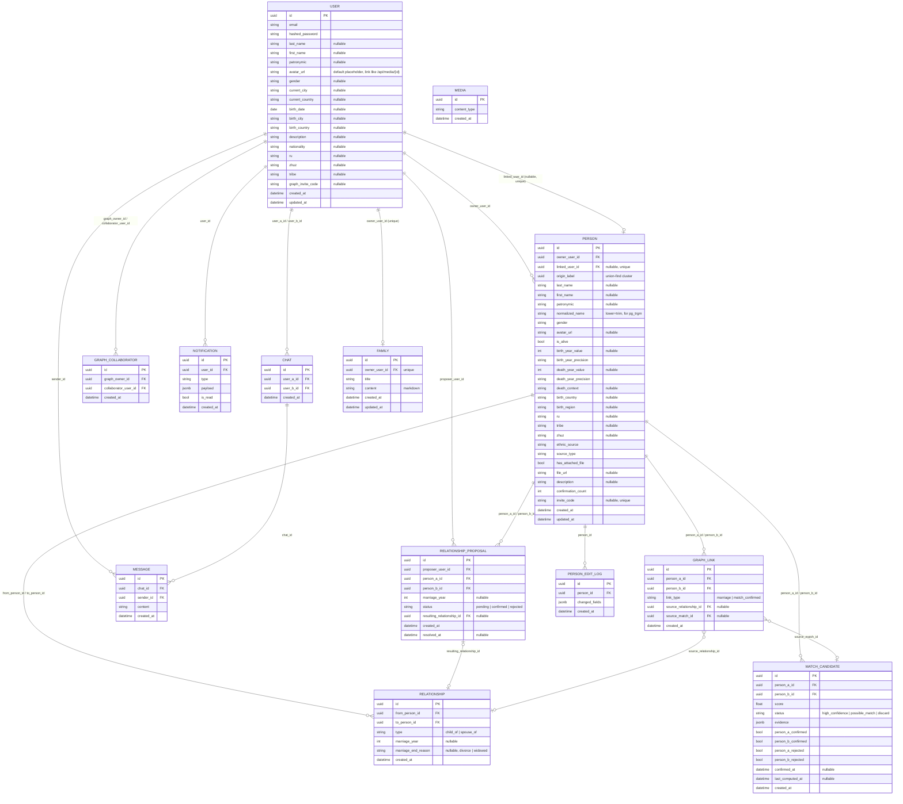
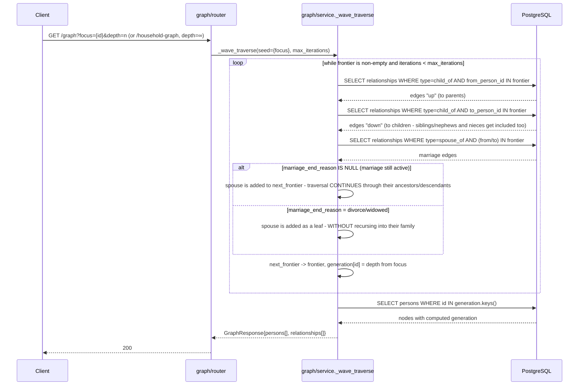
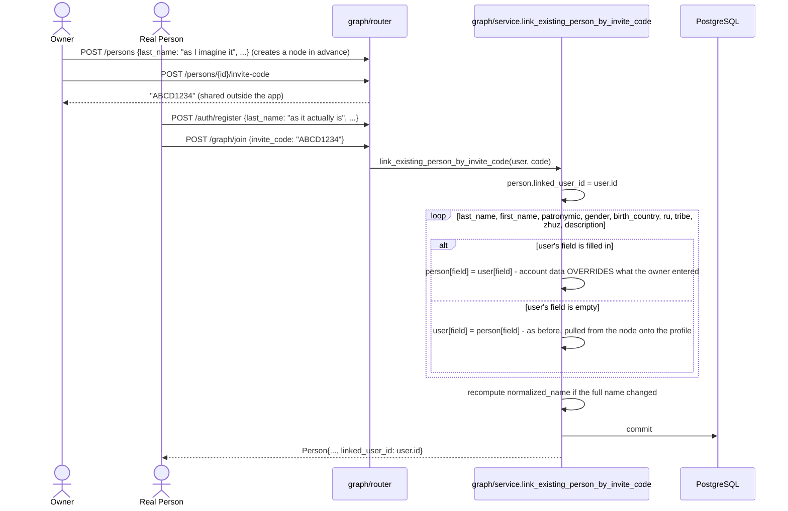
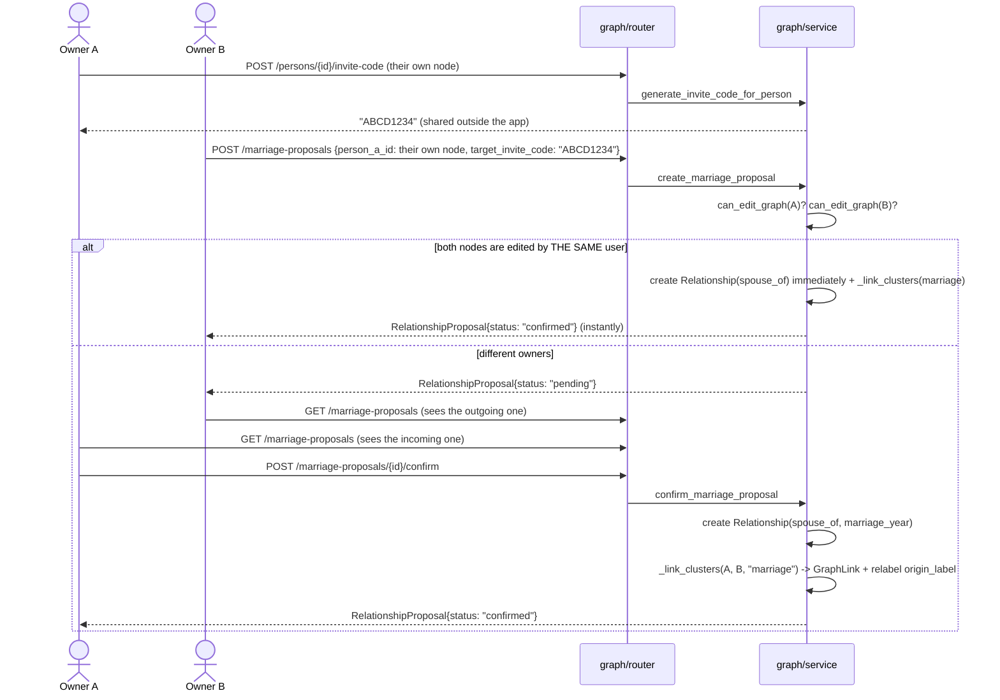
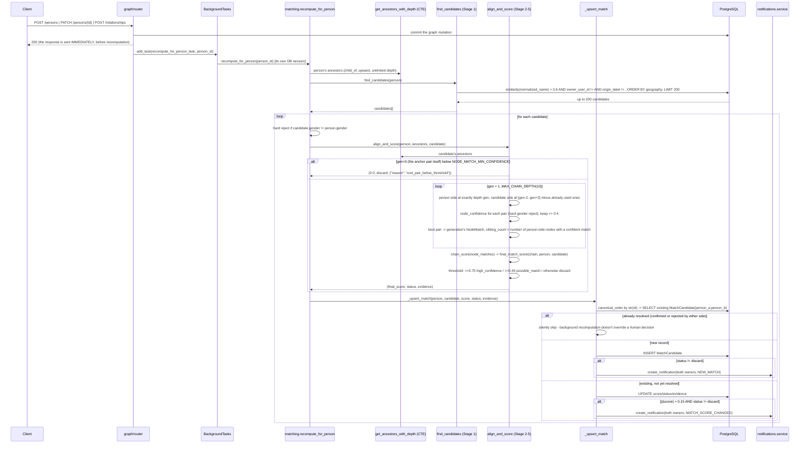
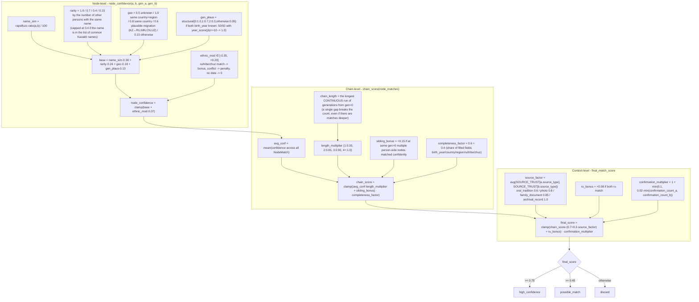
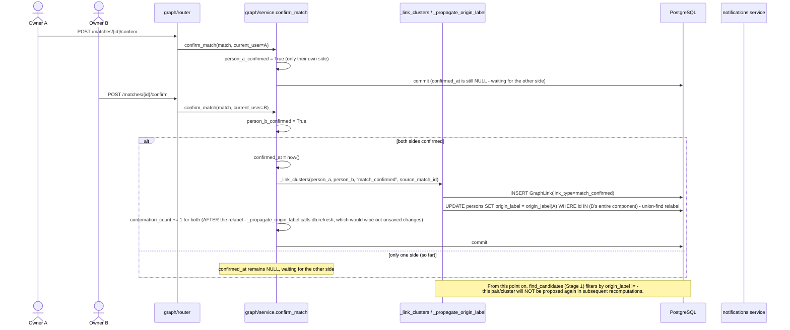

# Jeli

**A crowdsourced platform for reconstructing family trees**

Contributors
- https://github.com/moera-sudo
- https://github.com/itszhdi

The **Jeli** project was built during the **TechVision** hackathon, held from July 17 to July 21.

# Backend Description

## Stack

The backend is built entirely in **Python 3.14** using the **FastAPI** web framework. The project's key dependencies are:

1) UV - the Python package manager used in the project
2) FastAPI - the web framework
3) SQLAlchemy - the ORM for database interaction
4) asyncpg - the asynchronous driver for database interaction
5) rapidfuzz - a fuzzy string matching library, used in the matching algorithm
   to score full-name similarity between nodes from different trees (`fuzz.ratio`)
6) alembic - the database migration tool
7) pyjwt + passlib/bcrypt - issuing/verifying JWT tokens and password hashing (authentication)
8) python-multipart - handling multipart requests (file uploads in the media feature)

### Additional tools
- PostgreSQL - the primary database (including the `pg_trgm` extension - fuzzy name search in matching)
- docker/docker-compose - containerization tools for running the project
- make - a console command runner utility for convenient project management. If make is unavailable on your OS, you'll need to run the commands from the Makefile directly
- bruno - an API endpoint testing tool. The entire Bruno collection is available on GitHub in Jeli-Bruno

## Architecture

The project follows a client-server monolithic architecture: a FastAPI backend + PostgreSQL,
both spun up together via Docker Compose. The client is deployed separately. Documentation for all endpoints is available once the project is running, at `/api/docs` and `/api/redoc`.

### 1. Database, FastAPI, and Project Structure

Top-level structure of `src/`:

```
src/
├── config/            # settings.py (Pydantic Settings from .env), database.py (async engine/session), logging.py
├── dependencies.py     # shared FastAPI dependencies - get_user, get_user_ws
├── exceptions.py       # base AppException hierarchy + unified error handler
├── models.py           # ORM model aggregator for all features (needed by Alembic for autogenerate)
├── router.py            # route aggregator for all features under the common /api prefix
├── ws_manager.py        # ConnectionManager singleton - shared WebSocket manager
├── main.py             # FastAPI application entry point
└── features/
    ├── auth/
    ├── user/
    ├── graph/
    ├── matching/
    ├── notifications/
    ├── media/
    ├── messenger/
    ├── family/
    └── search/
```

Each feature under `features/` is a self-contained module with its own `router.py` (endpoints), `schemas.py`
(Pydantic request/response models), `models.py` (ORM models), `service.py` (business logic),
`exceptions.py` (feature-specific exceptions, inheriting from the shared hierarchy in `src/exceptions.py`),
`constants.py`, and `utils.py` - with no single project-wide "God" folder. This separation:

- **keeps feature code from mixing** - changes in `graph` don't drag along accidental changes in
  `matching` or `messenger`; each feature has clearly defined dependencies on others (for example,
  `matching` depends on `graph`, but not the other way around - this rule is enforced throughout the
  project to avoid circular imports);
- **simplifies onboarding and review** - a developer opening `features/media/` immediately sees the
  entire feature contract (what it accepts, what it stores, what it returns) without jumping around
  the whole repository;
- **scales linearly** - adding a new feature (like `family` or `search` at a later development
  stage) doesn't require touching existing modules, only registering the router/models in
  `src/router.py`/`src/models.py`;
- **`dependencies.py`** - a place for dependencies needed by SEVERAL features at once (`get_user` -
  a universal Bearer token check, `get_user_ws` - the same thing for WebSocket via the
  `?token=` query parameter, since the browser `WebSocket` API can't send headers);
- **`exceptions.py`** - all domain errors inherit from `AppException` with their own
  `status_code`; a single global handler turns them into a consistent JSON
  `{"detail": "..."}` response - features don't need to manually build HTTP error responses.

#### Database Schema (ERD)



`MEDIA` has no incoming foreign keys - it is referenced simply as a string `/api/media/{id}` from
the `avatar_url`/`file_url`/`content` (family markdown) fields, not via FK. The file is stored on disk
under the name `id`; `content_type` in the DB is needed only so that `GET /media/{id}` returns the
correct `Content-Type`.

### 2. Auth, Family, Media, Search, User

- **auth** - responsible for account creation and issuing sessions; it knows nothing else about
  the graph or the profile. Registration is deliberately available in two variants - a short one
  (email, password, full name only) and a full one (including city, date of birth, ethnic
  attributes, etc. right away), so as not to force the user through a multi-step questionnaire if
  they're already ready to fill everything in at once. The password is never stored in plain text -
  only as a bcrypt hash. The session is fully stateless: both the access and refresh tokens are
  plain JWTs; the server keeps no list of active sessions and cannot revoke them early - refreshing a
  token is simply verifying the old refresh token's signature and issuing a new pair. A tree invite
  code can be supplied right at registration, so a person can register and join their own node in a
  single action instead of two separate ones.
- **user** - stores the account's personal profile (contacts, geography, date of birth, ethnic
  attributes, biography) separately from the tree node - these are two different objects, because
  the same person may not yet have their own node in the graph, or conversely a node may have no
  linked account. Data from this profile is treated as authoritative: when a person joins their node
  via a code, it overrides whatever the tree owner had entered on their behalf (see the Graph
  section). Account deletion doesn't happen "in a vacuum" - if the user was the sole owner of a
  graph that contains other registered relatives, the system first requires ownership to be
  transferred to one of them, otherwise it refuses.
- **family** - a shared written family history, not a personal diary for each user: one entry
  **per whole graph**, not per person. The idea is that all members of one family - the graph owner,
  collaborators, relatives linked to nodes - read and edit the same text, and the result is visible
  identically to everyone rather than diverging into separate versions. Photos can be embedded in the
  history text via the shared media feature.
- **media** - a minimal file storage layer, not a standalone feature but a supporting layer for
  the others (avatars, photos in the family history). It's deliberately built to serve an already
  uploaded file without authorization - otherwise a plain `` tag on the frontend simply wouldn't
  display the picture, since the browser doesn't attach a Bearer token to image loads. There's also
  a shortcut path for "upload and immediately attach" - a single call can set an avatar both for
  yourself and for any tree node, including the node of a deceased person: having a photo in the
  family archive doesn't depend on whether the person is alive.
- **search** - a way to find a specific relative in the system by name, when you don't yet have
  their invite code. It searches by fuzzy substring match against the full names of registered users
  (not tree nodes), never returns the searcher themselves, and immediately reports whether the found
  person is linked to any node - this is exactly what lets the UI show a "message" button right in
  the search results, without a separate request.

### 3. WebSocket, Chats, and Notifications

The entire real-time application rests on a **single** WebSocket endpoint - `GET /api/ws?token=...` -
and one `ws_manager.ConnectionManager` singleton (`src/ws_manager.py`): a dictionary of `user_id ->
active connection`, at most one connection per user. Authorization uses the access JWT in the
`token` query parameter rather than the `Authorization` header: the standard browser `WebSocket` API
can't send custom headers during the handshake, so the token is passed in the URL. If the token is
missing or invalid, the connection is closed with code `1008` **before** `accept()`, so the client
gets an honest handshake rejection rather than an already-established connection being torn down.

All events, regardless of which feature produced them, travel through the same socket and are
distinguished only by the `"type"` field in the JSON body - this is what's called multiplexing:

```jsonc
{"type": "message", "message": {...}}          // messenger
{"type": "notification", "notification": {...}} // notifications
```

The channel is strictly server push-only: the client isn't required to send anything, and
whatever it does send is simply ignored by the server (`async for _ in websocket.iter_text(): pass`).

**Notifications** (`src/features/notifications/`) - a user's personal events.
`create_notification()` **always** saves a record to the DB (for history and offline access) and
**additionally** pushes it via `ConnectionManager.send_to_user` if the recipient is currently online -
if not, the event simply waits in the history until the next `GET /notifications`. Notification types
originate in other features through events: a new match, a noticeable change in a match's score, a
new chat message. Endpoints: `GET /notifications` (list, with an `unread_only` filter),
`POST /notifications/{id}/read`, `POST /notifications/read-all`, `DELETE /notifications/{id}`.

**Messenger** (`src/features/messenger/`) - simple 1-on-1 text chats on top of the same socket.
`Chat.user_a_id`/`user_b_id` are stored in canonical order (by `str(id)`, the same scheme as
`MatchCandidate.person_a_id/person_b_id`) - this makes `POST /chats` idempotent: calling it again
with the same `person_id` returns the already-existing chat instead of creating a duplicate,
regardless of which of the two initiated the conversation first. When sending a message
(`POST /chats/{id}/messages`) the service:
1. saves the `Message` to the DB;
2. pushes `{"type": "message", ...}` to the recipient (if online) - for instant rendering in an open
   chat;
3. in parallel creates a `new_message` notification via `notifications` - it lands in the
   notification history and arrives over the same socket as `{"type": "notification", ...}`,
   regardless of whether the recipient currently has this exact chat open.

Other endpoints: `GET /chats` (a list with the last message and `peer_user_id` - so the frontend
can immediately open the interlocutor's profile), `GET /chats/{id}/messages` (history),
`DELETE /chats/{id}` (cascades to delete both the chat itself and all messages).

### 4. Graph and Matching

#### 4.1. Graph Design

There is no separate "graph" entity in the DB - a user's graph is simply the set of `Person`
nodes sharing a common `owner_user_id`; everything else is edges between them. Key invariants:

- `Relationship.type = "child_of"` is directed **child → parent** (`from_person_id` = the child).
  A maximum of 2 outgoing `child_of` edges per node (`MAX_PARENTS_PER_PERSON = 2`).
- `generation` (depth/generation) is not stored anywhere - it's computed on the fly with a
  recursive CTE from the viewpoint on every request.
- `origin_label` - a cluster label (union-find). All nodes of one originally disconnected branch
  share the same label; on a confirmed marriage or match, the entire component on one side is
  relabeled to the other side's label - without physically merging records.
- There are three permission levels on a node: the graph owner (`owner_user_id`) - full access;
  a collaborator (`graph_collaborators`) - access to the owner's entire graph, though only a node
  already linked to a live account can be assigned as one; the living person themselves
  (`linked_user_id == current user`) - can edit their own node even without being the graph owner.
  Reading the graph is fully open to any authenticated user - only mutations are restricted.

**Traversing ancestors/generations - the spouse rule.** The same wave algorithm
(`_wave_traverse`) is used both for `GET /graph` (with a depth limit) and for `household-graph`
(unlimited):



An active marriage continues the traversal through the spouse (pulling in their entire line -
this is how two independently created trees "merge" for display once there's a marriage between
them), while a dissolved one cuts it off at the leaf level, without recursing into their family.

**Joining via invite code - the person's own data takes priority.** When an owner manually
creates a node for a living relative in advance, and that person later registers and joins via the
code, the data the person just entered about themselves at registration overrides what the owner had
entered:



**Marriage between independent trees** - a direct edge between nodes of different owners cannot
be created directly, only through a proposal/confirmation:



#### 4.2. Matching Algorithm

The goal isn't to "find a name match," but to assemble an evidentiary chain of common ancestors
between two independently filled-in trees, and only when that chain is long/confident enough to
offer it to the users for confirmation.

**From a graph mutation to a recorded match and notification.** The recomputation is always
full (all 5 stages from scratch) - triggered by any node or relationship creation/edit
(`POST /persons`, `PATCH /persons/{id}`, `POST /persons/insert-between`, `POST /relationships`), and
runs in the background after the client has already received a response:



**Scoring formula** - three levels of weights, exact values:



The key idea behind the weights: a single name match (`chain_length=1`) yields a multiplier of
only **0.35** - this is exactly the "same surname, unrelated" case, not an actual relative.
Evidentiary strength grows nonlinearly with the length of a continuous chain of matched
generations, rather than with one striking match.

**Confirmation and cluster merging** - automatic merging of branches never happens; even
`high_confidence` remains a proposal requiring explicit consent from both sides:



`reject_match` is the mirror image, but never calls `_link_clusters`; rejection by one side
permanently blocks a repeat confirm from that same side.

## Running the Project

1. Copy `.env.example` to `.env` and fill in the values (`DATABASE_URL`, `POSTGRES_*`,
   `JWT_SECRET_KEY`, ports, etc.) - the application won't start without `JWT_SECRET_KEY`/`DATABASE_URL`.
2. Bring up the backend + PostgreSQL with a single command:
   ```
   make up
   ```
3. Apply DB migrations:
   ```
   make migrate
   ```
4. The backend is available at `http://localhost:<BACKEND_PORT>/api`, Swagger at `/docs`.

Other useful commands from the `Makefile`:

- `make down` / `make restart` - stop / rebuild and restart the containers
- `make logs` - backend container logs
- `make makemigrations m="description"` - generate a new Alembic migration from model changes
- `make reset-db` - a **full** DB reset (drops the entire volume) + migrations from scratch, for
  a clean environment
- `make sync` - sync dependencies via `uv`
- `make run` - local run without Docker (requires an available PostgreSQL, see `.env`)
- `make matching-test` - a load/accuracy test of the matching algorithm on synthetic trees
  (`Jeli-Bruno/scripts/matching_load_test.py`)

## Testing

All endpoints are covered by an automated **Bruno** collection - `Jeli-Bruno/` at the project
root. Environment variables live in `Jeli-Bruno/environments/local.yml`, and the `scenario/` folder
runs a realistic multi-user scenario (several accounts, overlapping trees, chats, matching,
collaborators) entirely through the real HTTP API. To run the whole suite:

```
cd Jeli-Bruno && npx --yes @usebruno/cli run . -r --env local --tests-only
```

(`--tests-only` skips the collection's single native `type: websocket` item, which the CLI can't
execute - it exists only for manual verification in the Bruno desktop app.)


# Frontend Description

## Stack

The frontend is built entirely in **JavaScript (JSX)** using **React 19**, bundled with **Vite 8**. Key dependencies:

1. **Vite** — the bundler and dev server (`npm run dev` / `npm run build` / `npm run preview`)
2. **React 19** + **react-dom** — the UI library
3. **react-router-dom v7** — routing (protected/public routes, nested layout)
4. **@xyflow/react (React Flow) v12** — rendering the family graph (custom nodes/edges, zoom, panning)
5. **@dagrejs/dagre** — an auxiliary layout engine, used in `utils/buildFlow.js` only to "seed" the initial left-to-right node ordering (crossing minimization); the final coordinates are computed by a custom sweep algorithm on top of Dagre
6. **axios** — the HTTP client, a single instance with interceptors (`api/axiosConfig.js`)
7. **react-markdown** — rendering the family history
8. **react-icons** — icons

## Architecture

An SPA (Single Page Application), fully decoupled from the backend — deployed separately, communicating with `jeli-server` only via a REST API (JSON) at the base URL configured in `api/axiosConfig.js`. Authentication is JWT-based, stored and attached to headers via an axios interceptor; on a 401, it redirects to login via `ProtectedRoute`.

## Project Structure

```
front/
├── index.html                  # Vite entry point
├── vite.config.js
├── package.json
└── src/
    ├── main.jsx                 # React entry point, mounts into the DOM
    ├── index.css                # global styles
    ├── Routes/                  # routing
    ├── Pages/                    # screens tied to routes
    ├── Components/               # reusable composite blocks, 
    ├── UI/                       # low-level design-system primitives
    └── utils/                    # pure helpers and React context
```

## Key Architectural Decisions

- **The graph is not the library's declarative layout but a custom algorithm** (`buildFlow.js`): Dagre is used only to obtain the relative ordering of nodes (crossing minimization), while the final coordinates are the result of a manual sweep that keeps pairs (`couple`/`union`) next to each other and centers generations above one another. This is a deliberate choice for a "family-style" graph view (a couple is always adjacent, children sit under their shared union), which the standard Dagre layout doesn't provide out of the box.
- **The API layer is fully decoupled from components** — components never work with axios directly, only through `api/*Service.js`, which mirrors the backend feature structure (`graph`, `auth`, `media`, `messenger`, `notifications`).
- **Routes are protected at the wrapper level** (`ProtectedRoute`/`PublicOnlyRoute`), rather than with checks inside each individual page.

## Running the Project

1. Node.js must be installed:
```
node -v
```

2. Run the command to install all dependencies:
```
npm install
```

3. Start the local server
```
npm run dev
```

4. The platform is available at: http://localhost:5173
