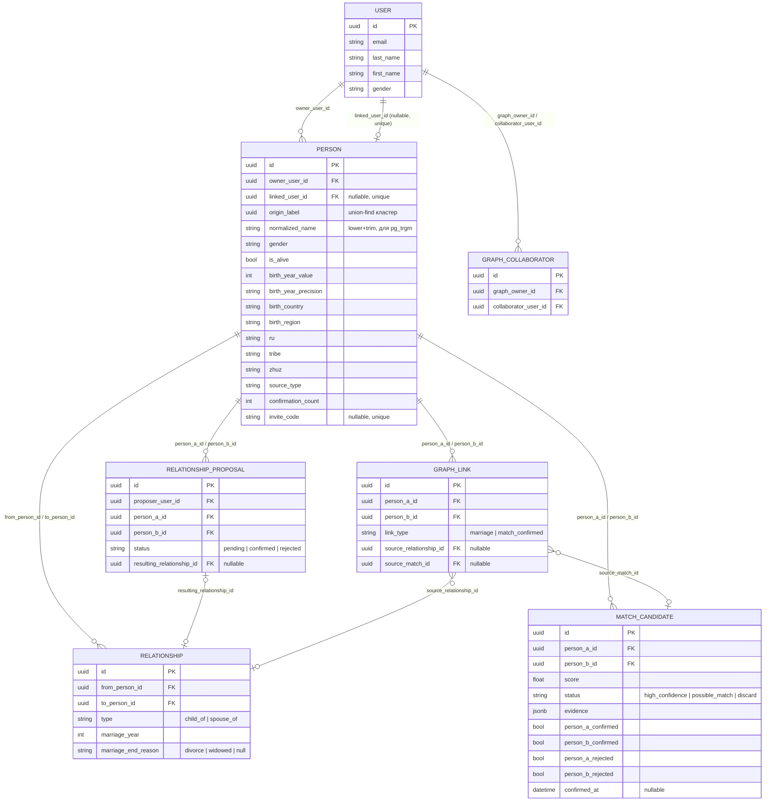
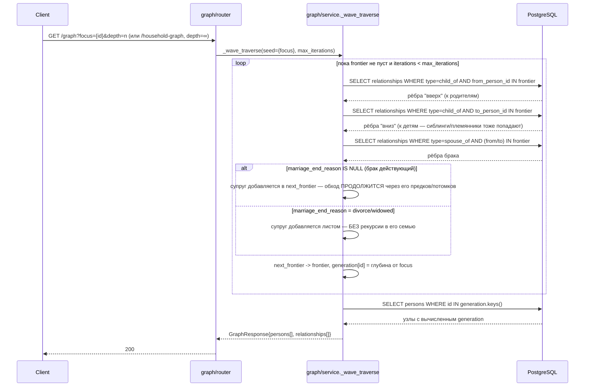
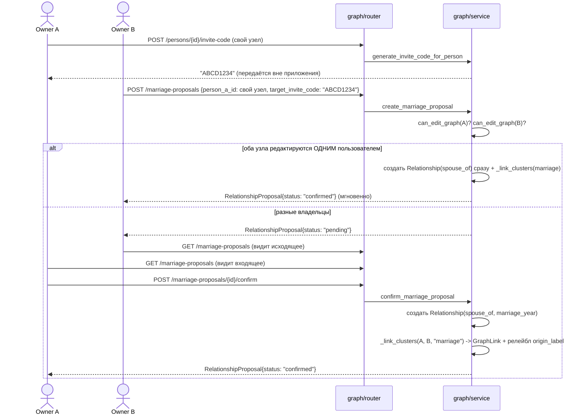
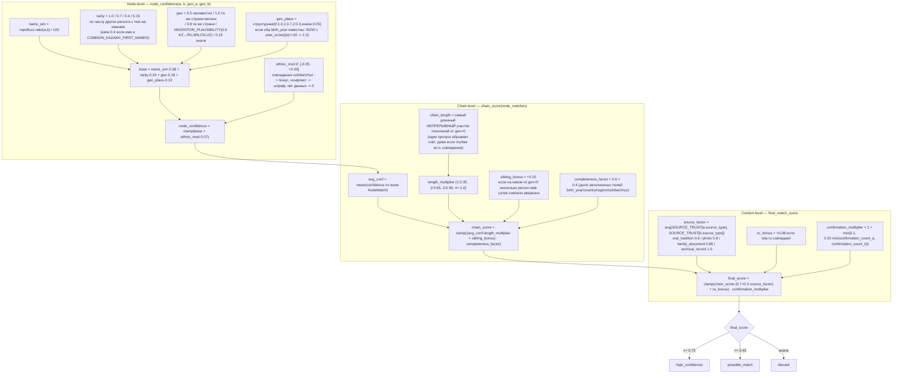
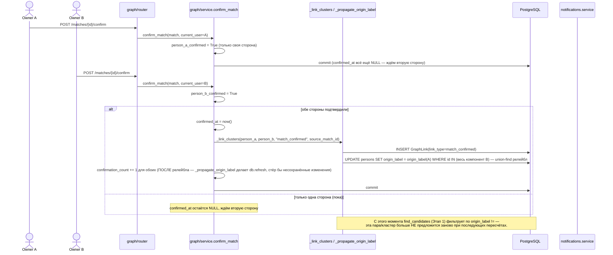

# Jeli — устройство графа, алгоритм мэтчинга и нагрузочный тест

Этот документ — по факту реализованного кода (`src/features/graph/`, `src/features/matching/`), не
по исходным дизайн-докам (`hackaton/docs/*.md`), которые местами разошлись с тем, что было
реализовано. Расхождения отмечены явно там, где важны.

---

## 1. Устройство графа

### 1.1. Сущности



**Ключевые инварианты** (не видны из одной ER-схемы):

- `child_of` направлен **ребёнок → родитель** (`from_person_id` = ребёнок). Максимум 2 ребра
  `child_of` "от себя" на узел (`MAX_PARENTS_PER_PERSON = 2`).
- `generation` нигде не хранится — считается на лету рекурсивным CTE от точки обзора при каждом запросе.
- `origin_label` — метка кластера (union-find). Все узлы одной изначально несвязанной ветки имеют
  одинаковую метку; при подтверждённом браке или мэтче весь компонент одной стороны перекрашивается
  в метку другой.
- Три уровня прав на узел: владелец графа (`owner_user_id`) — полный доступ; коллаборатор
  (`graph_collaborators`) — доступ ко всему графу владельца, но им можно назначить только уже
  привязанный к живому аккаунту узел; сам живой человек (`linked_user_id == текущий пользователь`) —
  может редактировать свой собственный узел, даже не будучи владельцем графа.
- Чтение графа полностью открыто любому авторизованному пользователю — закрыты только мутации.

### 1.2. Обход предков/поколений — правило супруга



Именно это правило "действующий брак продолжает обход, расторгнутый — обрывает" — то, как два
независимо созданных дерева "сливаются" для отображения после брака между ними, без физического
слияния данных: ребёнок от межграфового брака просто получает два `child_of`-ребра, и bloodline
естественно проходит через обе линии.

### 1.3. Брак между независимыми деревьями



Прямое ребро между узлами разных владельцев создать нельзя — только через этот proposal/confirm
флоу, что и демонстрирует модель прав: мутация чужого узла возможна только с согласия его владельца.

---

## 2. Алгоритм мэтчинга

Реализация в целом точно следует дизайн-доку `matching-algorhitm.md` (веса, пороги, диапазоны
совпадают буквально), но есть значимые расхождения:

- **Партиальный event-driven пересчёт не реализован.** Дока описывает `on_person_updated(changed_fields)`,
  пересчитывающий только затронутый компонент (гео/этника/имя). В коде — всегда **полный** 5-этапный
  пересчёт всего person'а на любой create/edit (комментарий в `matching/service.py` называет это
  осознанным упрощением для маленького хакатон-датасета). `PersonEditLog` существует в БД, но нигде
  не читается/пишется пайплайном мэтчинга — незадействованная заготовка.
- **Окно по годам рождения на Этапе 1 не реализовано** — SQL кандидатов фильтрует только по
  `pg_trgm`-схожести имени и сортирует по гео, без предиката по году.
- **`NODE_MATCH_MIN_CONFIDENCE = 0.4`** и **`COMMON_KAZAKH_FIRST_NAMES`** (капа rarity для частых
  имён) — оба явно помечены в коде как добавленные СВЕРХ дока, не специфицированы там.
- **Приватность живых людей (§9 дока: "последние 1-2 поколения не показываются в авто-мэтчинге")
  не соблюдается в коде** — ни в `find_candidates`, ни в `align_and_score` нет фильтра по `is_alive`.

### 2.1. От мутации графа до записи матча и уведомления

```mermaid
sequenceDiagram
    participant C as Client
    participant R as graph/router
    participant BG as BackgroundTasks
    participant M as matching.recompute_for_person
    participant CTE as get_ancestors_with_depth (CTE)
    participant F1 as find_candidates (Stage 1)
    participant A as align_and_score (Stage 2-5)
    participant U as _upsert_match
    participant DB as PostgreSQL
    participant N as notifications.service

    C->>R: POST /persons | PATCH /persons/{id} | POST /relationships
    R->>DB: commit мутации графа
    R-->>C: 200 (ответ уходит СРАЗУ, до пересчёта)
    R->>BG: add_task(recompute_for_person_task, person_id)

    BG->>M: recompute_for_person(person_id)  [своя DB-сессия]
    M->>CTE: предки person'а (child_of, вверх, без ограничения глубины)
    M->>F1: find_candidates(person)
    F1->>DB: similarity(normalized_name) > 0.6 AND owner_user_id != AND origin_label != , ORDER BY гео, LIMIT 200
    DB-->>F1: до 200 кандидатов
    F1-->>M: candidates[]

    loop для каждого кандидата
        M->>M: hard reject если candidate.gender != person.gender
        M->>A: align_and_score(person, ancestors, candidate)
        A->>CTE: предки кандидата
        alt gen=0 (сама якорная пара) ниже NODE_MATCH_MIN_CONFIDENCE
            A-->>M: (0.0, discard, {"reason": "root_pair_below_threshold"})
        else
            loop gen = 1..MAX_CHAIN_DEPTH(10)
                A->>A: person-сторона на глубине ровно gen; candidate-сторона на [gen-2, gen+2] минус уже использованные
                A->>A: node_confidence на каждую пару (hard gender reject), оставить >= 0.4
                A->>A: лучшая пара -> NodeMatch поколения; sibling_count = кол-во person-side узлов с уверенным совпадением
            end
            A->>A: chain_score(node_matches) -> final_match_score(chain, person, candidate)
            A->>A: порог: >=0.75 high_confidence / >=0.45 possible_match / иначе discard
            A-->>M: (final_score, status, evidence)
        end
        M->>U: _upsert_match(person, candidate, score, status, evidence)
        U->>DB: canonical_order по str(id) -> SELECT существующий MatchCandidate(person_a,person_b)
        alt уже resolved (confirmed или rejected любой стороной)
            U->>U: молча пропустить — фоновый пересчёт не переписывает решение человека
        else новая запись
            U->>DB: INSERT MatchCandidate
            alt status != discard
                U->>N: create_notification(оба владельца, NEW_MATCH)
            end
        else существующая, ещё не resolved
            U->>DB: UPDATE score/status/evidence
            alt |Δscore| > 0.15 AND status != discard
                U->>N: create_notification(оба владельца, MATCH_SCORE_CHANGED)
            end
        end
    end
```

### 2.2. Формула скоринга



### 2.3. Подтверждение и слияние кластеров



`reject_match` — зеркально, но никогда не вызывает `_link_clusters`; отклонение одной стороной
финально блокирует повторное confirm с этой же стороны.

---

## 3. Нагрузочный/точностный тест

**Методология**: `Jeli-Bruno/scripts/matching_load_test.py` строит 20 независимых деревьев (владелец
+ полное бинарное дерево предков на 5 поколений — 63 узла на дерево, 1260 узлов всего) через
реальный HTTP API (`POST /auth/register` → `PATCH /users/profile/edit` → `POST /graph/create` →
`POST /persons` с `relation.type="parent"`, level-by-level). В 10 пар непересекающихся деревьев
подсажен **предковый конус** (узел на глубине g + все его предки вплоть до 5 поколения, скопированные
идентично между двумя деревьями) — 8 пар должны дать non-discard матч на разной глубине, 2 —
намеренные негативные контроли (одиночный узел без цепочки, должен получить `discard`). После
устаканивания фонового пересчёта (`GET /persons/{id}/matches`, polling до стабильного отпечатка)
собраны все `MatchCandidate` (включая discard — они тоже персистятся) и посчитаны precision/recall
против подсаженных пар, плюс проверена ветка `POST /matches/{id}/confirm` на выборке пар (слияние
кластеров через `GraphLink(match_confirmed)`, видимое в `GET /persons/{id}/household-graph`).

### 3.1. Находка: гонка между построением дерева и триггером пересчёта

Первый же прогон (на дереве, построенном "сверху вниз" — сначала владелец, затем его предки) дал
**0% recall** — ВСЕ найденные матчи, включая заведомо идентичные подсаженные пары, получили
`discard` с `chain_length=1` (совпал только сам якорный узел, ни одного предка). Причина — реальный
архитектурный пробел, не баг тестового скрипта:

> `POST /persons {relation: {type: "parent", to_person_id}}` планирует `recompute_for_person_task`
> **только для нового (родительского) узла** (`graph/router.py:126`) — существующий узел
> (`to_person_id`, тот, кому только что добавили родителя) свой пересчёт не получает.

При построении дерева сверху вниз (сначала узел, потом его предки — иначе и не построить, ведь
`to_person_id` должен уже существовать) это означает: пересчёт КАЖДОГО узла срабатывает СРАЗУ при
его создании, когда его собственные предки ещё не существуют физически (они появятся на следующих
уровнях). Цепочка предков при этом первом (и единственном автоматическом) пересчёте — всегда пуста.
**Ничто в приложении не переигрывает этот пересчёт позже**, когда предки уже добавлены — ни отдельного
события "добавили предка существующему узлу", ни фонового ресканирования.

Тестовый скрипт компенсирует это явным финальным проходом (`touch_all_persons`) — `PATCH` каждого
узла его же текущим `source_type` уже ПОСЛЕ полной постройки дерева (PATCH безусловно
перетриггеривает пересчёт, `graph/router.py:208`). Без этого шага результаты теста были бы
бессмысленны. **В реальном использовании этот пробел означает**: если пользователь сначала завёл
свой узел, а потом (в отдельном сеансе, позже) добросовестно дополнил его предками на 3-4 поколения
назад — его СОБСТВЕННЫЕ матчи не обновятся автоматически, пока он не отредактирует ЧТО-ТО в своей же
карточке (что запустит полный пересчёт заново). Стоит рассмотреть добавление recompute-триггера и
для `to_person_id`/`relation`-цели при `POST /persons`, аналогично тому, как `POST /relationships`
уже триггерит пересчёт для ОБЕИХ сторон нового ребра (`graph/router.py:327-328`).

### 3.2. Результаты (реальный прогон, чистая БД)

`make reset-db && make matching-test` — 20 деревьев × 63 узла (5 полных поколений предков) = 1260
персон, 10 подсаженных пар (8 позитивных на разной глубине входа + 2 намеренных негативных контроля
— одиночный несвязанный узел без цепочки).

| Метрика | Значение |
|---|---|
| Recall (8 позитивных подсаженных пар) | **100%** (8/8) |
| Негативные контроли верно отброшены (discard) | **2/2** |
| Precision (строгая — только точки входа как TP) | 14% |
| Precision (включающая — + легитимные пары-спутники внутри подсаженного конуса) | 46% |
| F1 (recall × строгая precision) | 0.246 |
| Ветка подтверждения (`confirm` → `GraphLink(match_confirmed)`) | **4/4** успешно |
| Всего `MatchCandidate` найдено | 212 (10 high_confidence, 47 possible_match, 155 discard) |
| Средняя/медианная `chain_length` (non-discard) | 2.58 / 2 |
| `sibling_confirmed` среди non-discard | 100% |
| Время: построение / re-touch / устаканивание / итого | 19.6с / 12.4с / 18.8с / **54.3с** |
| HTTP-запросов | 4092 |

Все 8 подсаженных позитивных пар получили **в точности ожидаемый статус** по глубине входа
(2 × high_confidence на g=2, 3 × high_confidence/possible_match на g=3, 3 × possible_match на g=4) —
формулы скоринга (раздел 2.2) ведут себя ровно так, как описывают веса. Обе негативные контроли
(одиночный узел без предковой цепочки, g=5) корректно получили `discard` — единичное совпадение
имени без цепочки — ровно тот случай "однофамилец", от которого должна защищать структура весов
(`length_multiplier[1]=0.35`).

**31 "ложных срабатывания"** (matches, не относящиеся ни к точкам входа, ни к легитимным
парам-спутникам внутри подсаженных конусов) — при ручной проверке evidence все они оказались
результатом **недостаточного разнообразия пула имён** относительно строгости Этапа 1, а не сбоем
логики алгоритма:

- Общий пул теста — всего ~56 фамилий на 1260 синтетических персон (≈22 человека на фамилию) — Этап 1
  фильтрует по `pg_trgm similarity(normalized_name) > 0.6` на ПОЛНОМ имени (фамилия+имя+отчество), а
  это условие может выполниться и при совпадении всего 2 из 3 частей (напр. одинаковые имя+отчество
  при разных фамилиях — реальный пример из отчёта: "Есенов Балжан Кенжеқызы" vs "Абенов Балжан
  Кенжеқызы", `name_similarity=0.913`, оба из одного ру/племени/жуза случайно — итоговый скор 0.80,
  `high_confidence`).
- Дальше по цепочке допуск ±2 поколения (`GEN_OFFSET_TOLERANCE`) в сочетании с "выбрать ЛУЧШУЮ пару
  среди кандидатов на каждом уровне" даёт алгоритму шанс найти правдоподобно выглядящую (но
  случайную) пару почти на каждом уровне при небольшом пуле фамилий — так случайные несвязанные
  предки собираются в цепочку длиной 3-5 поколений чисто по теории вероятностей.
- Это не столько находка про баг, сколько про **чувствительность алгоритма к размеру пула фамилий в
  реальном пользовательском масштабе**: на раннем этапе роста продукта (мало пользователей, узкий
  набор реально встречающихся фамилий в конкретном регионе) можно ожидать более высокую долю
  `possible_match`-предложений, требующих отклонения пользователем, чем на зрелом масштабе с
  тысячами разных фамилий. Осознанное `discard`-по-умолчанию до порога 0.45 и обязательное ручное
  `confirm` с обеих сторон (раздел 2.3) — это и есть встроенная защита от подобных случайностей:
  ни один `high_confidence` не приводит ни к чему автоматически.

Полный дамп (все 212 матчей, полная гистограмма скоров, все 31 ложных срабатываний с evidence) —
`Jeli-Bruno/reports/matching_load_test_20260720T232618Z.{json,md}`.
